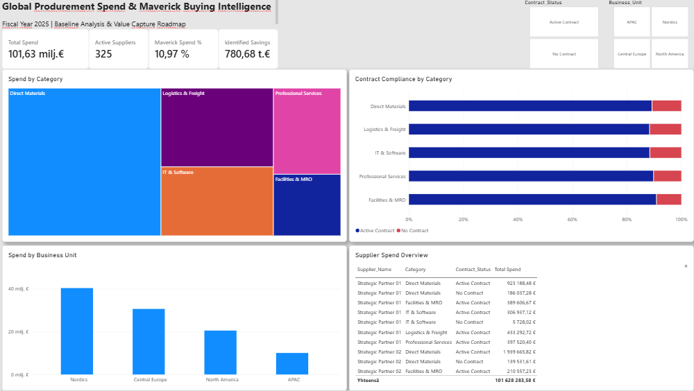

Markdown
# Global Procurement Spend & Maverick Buying Intelligence

An end-to-end strategic procurement analytics project modeling enterprise spend behaviors, quantifying maverick buying leakages, and establishing a targeted value-capture roadmap across 4 global operating units.

**Executive Summary**
Baseline Spend: €101.63M analyzed across 325 distinct suppliers.

Maverick Buying Rate: 10.97% (€11.15M) non-compliant, uncontracted spend.

Identified Value Capture: €780.68k in direct addressable bottom-line savings via supplier consolidation and frame contract standardization (7% renegotiation hurdle).

**Business Problem & Context**
Large-scale decentralized procurement organizations frequently suffer from:

Maverick Buying: Business units bypassing master service agreements (MSAs), exposing the enterprise to higher spot-market rates.

Tail Spend Inefficiencies: Excessive volume of small-ticket suppliers driving up transactional accounting overhead and diluting volume rebates.

Data Silos: Lack of automated cross-category visibility into compliance and category distribution.

Technical Architecture & Methodology
**1. Data Generation & Distribution Modeling (Python)**
Generated a transactional dataset of 5,000 line items via numpy and pandas.

Modeled spend magnitude using an exponential distribution to reflect realistic enterprise Pareto dynamics (top 10% suppliers capturing ~70% spend).

Script: generate_data.py

**2. Data Engineering & Transformation (Power Query)**
Enforced strict locale data typing (US decimal encoding vs. EU currency formatting).

Handled null values, standardized category taxonomies, and built relational integrity for reporting.

**3. Metric Architecture (DAX)**
Total Spend: SUM(procurement_spend_data_2025[Spend_EUR])

Active Suppliers: DISTINCTCOUNT(procurement_spend_data_2025[Supplier_Name])

Maverick Spend: Dynamic CALCULATE measure filtering uncontracted purchase lines.

Maverick %: Safe ratio calculation using DIVIDE([Maverick Spend], [Total Spend], 0).

Identified Savings: Value capture calculation benchmarked at a 7% negotiated discount uplift.

**4. Visual Cockpit Design (Power BI)**
High-contrast, executive container layout adhering to modern BI design systems.

Cross-filtering slicers enabling regional drill-downs by Business_Unit and Contract_Status.

100% stacked category compliance analysis exposing non-compliant spend drivers.

**Strategic Recommendations**
Immediate (0–90 days): Enforce hard approval gates in ERP/P2P systems for uncontracted purchase orders in Logistics & Freight and IT & Software.

Consolidation Wave (3–6 months): Aggregate tail vendors into regional preferred supplier lists (PSLs) via competitive sourcing events.

Governance: Deploy automated weekly Power BI refreshes to flag invoice variance prior to finance sign-off.

**Repository Structure**
generate_data.py – Python data generation script

procurement_spend_data_2025.csv – Synthetic spend dataset

dashboard_preview.png – Executive Power BI dashboard snapshot

README.md – Project documentation & business case
